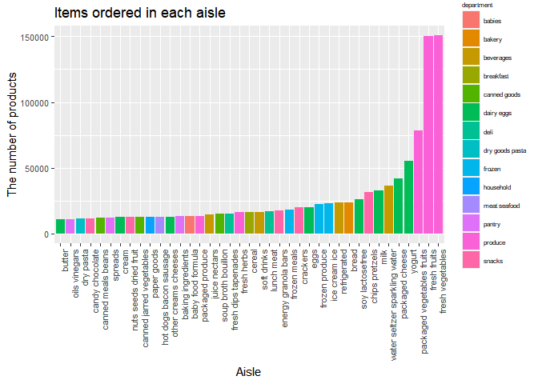
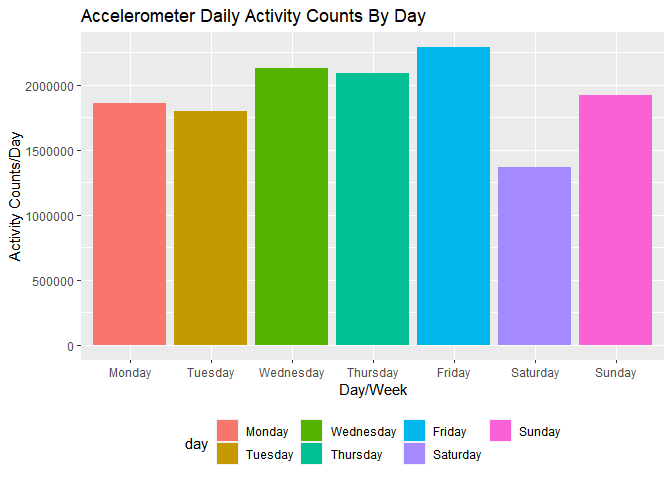
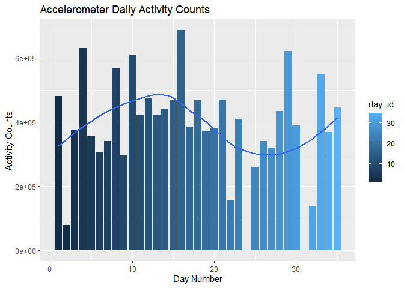
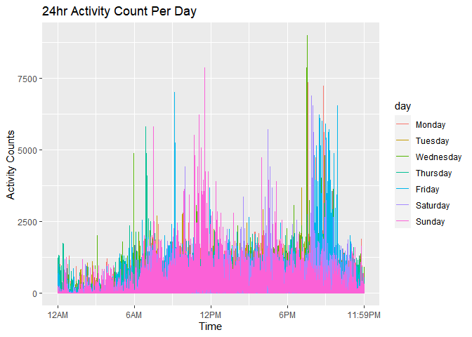
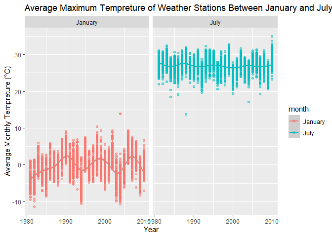
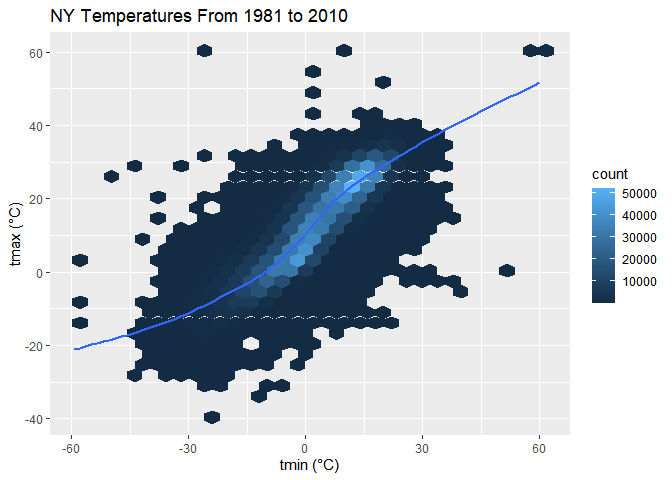
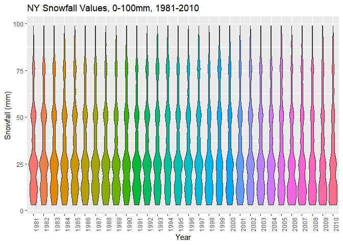
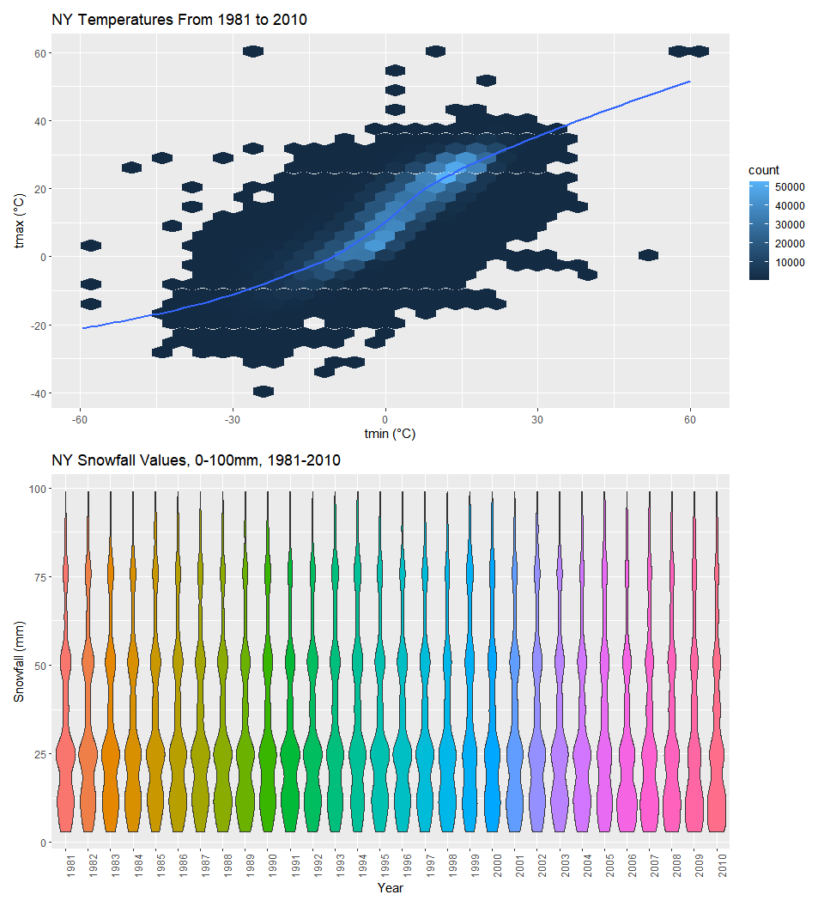

P8105_hw3_rc3521
================
Runze Cui
2022-10-11

## Problem 1

``` r
data("instacart")
instacart
```

    ## # A tibble: 1,384,617 × 15
    ##    order_id product_id add_to_…¹ reord…² user_id eval_…³ order…⁴ order…⁵ order…⁶
    ##       <int>      <int>     <int>   <int>   <int> <chr>     <int>   <int>   <int>
    ##  1        1      49302         1       1  112108 train         4       4      10
    ##  2        1      11109         2       1  112108 train         4       4      10
    ##  3        1      10246         3       0  112108 train         4       4      10
    ##  4        1      49683         4       0  112108 train         4       4      10
    ##  5        1      43633         5       1  112108 train         4       4      10
    ##  6        1      13176         6       0  112108 train         4       4      10
    ##  7        1      47209         7       0  112108 train         4       4      10
    ##  8        1      22035         8       1  112108 train         4       4      10
    ##  9       36      39612         1       0   79431 train        23       6      18
    ## 10       36      19660         2       1   79431 train        23       6      18
    ## # … with 1,384,607 more rows, 6 more variables: days_since_prior_order <int>,
    ## #   product_name <chr>, aisle_id <int>, department_id <int>, aisle <chr>,
    ## #   department <chr>, and abbreviated variable names ¹​add_to_cart_order,
    ## #   ²​reordered, ³​eval_set, ⁴​order_number, ⁵​order_dow, ⁶​order_hour_of_day

Description for dataset `instacart` : This dataset has 1,384,617 rows
and 15 columns (1,384,617 observations and 15 variables). The
`instacart` dataset illustrate an online grocery service in New York
City. Several key variables are listed such as `order_id` and
`product_id`. It records the type of food which are ordered. The
specific name of products are also clarified in `product_name`. And
`department` lists which apartment the ordered products are belong to in
each observation.

Now, I am going to answer the questions:

Question 1:

``` r
instacart %>% 
  janitor::clean_names() %>% 
  distinct(aisle) %>% 
  nrow()
```

    ## [1] 134

``` r
instacart %>% 
  group_by(aisle) %>% 
  summarize(n_obs = n()) %>% 
  mutate(aisle_ranking = min_rank(desc(n_obs))) %>% 
  filter(aisle_ranking == 1) 
```

    ## # A tibble: 1 × 3
    ##   aisle             n_obs aisle_ranking
    ##   <chr>             <int>         <int>
    ## 1 fresh vegetables 150609             1

So there are 134 distinct aisles and the the most items ordered should
be *Fresh vegetables*

Question 2:

Make a plot based on aisle:

``` r
instacart %>%
  group_by(aisle, department) %>% 
  summarize(n_obs = n()) %>%
  arrange(desc(n_obs)) %>%
  rename(no_items = n_obs) %>% 
  filter(no_items > 10000) %>% 
  mutate(as.numeric(no_items)) %>% 
  ggplot(aes(x = reorder(aisle, no_items), y = no_items, fill = department)) +  
  geom_col() +
  theme(axis.text.x = element_text(angle = 90, hjust = 1),
        axis.text = element_text(size = 8) ) +
  theme(
    legend.title = element_text(size = 6), 
    legend.text = element_text(size = 6),
    legend.background = element_rect(fill = "white", size = 0.5),
    legend.position = "right") +
  labs(
    title = "Items ordered in each aisle",
    x = "Aisle",
    y = "The number of products",
  ) 
```

    ## `summarise()` has grouped output by 'aisle'. You can override using the
    ## `.groups` argument.

<!-- -->

Question 3:

Make a table to show three most popular items in each of the aisles
“baking ingradients”, “dog food care”, and “packaged vegetables fruits.”
Include the number of times for each item is ordered in the table.

``` r
instacart %>% 
  filter(aisle %in% c("baking ingredients", "dog food care", "packaged vegetables fruits")) %>%
  group_by(aisle) %>% 
  count(product_name) %>% 
  mutate(rank = min_rank(desc(n))) %>% 
  filter(rank < 4) %>% 
  arrange(desc(n)) %>%
  knitr::kable()
```

| aisle                      | product_name                                  |    n | rank |
|:---------------------------|:----------------------------------------------|-----:|-----:|
| packaged vegetables fruits | Organic Baby Spinach                          | 9784 |    1 |
| packaged vegetables fruits | Organic Raspberries                           | 5546 |    2 |
| packaged vegetables fruits | Organic Blueberries                           | 4966 |    3 |
| baking ingredients         | Light Brown Sugar                             |  499 |    1 |
| baking ingredients         | Pure Baking Soda                              |  387 |    2 |
| baking ingredients         | Cane Sugar                                    |  336 |    3 |
| dog food care              | Snack Sticks Chicken & Rice Recipe Dog Treats |   30 |    1 |
| dog food care              | Organix Chicken & Brown Rice Recipe           |   28 |    2 |
| dog food care              | Small Dog Biscuits                            |   26 |    3 |

Question 4:

Another table

``` r
instacart %>% 
  filter(product_name %in% c("Pink Lady Apples", "Coffee Ice Cream")) %>% 
  group_by(product_name, order_dow) %>%
  summarize(mean_time = round(mean(order_hour_of_day), digits = 1)) %>% 
  pivot_wider(
    names_from = "order_dow",
    values_from = "mean_time") %>%
  knitr::kable(digits = 1)
```

    ## `summarise()` has grouped output by 'product_name'. You can override using the
    ## `.groups` argument.

| product_name     |    0 |    1 |    2 |    3 |    4 |    5 |    6 |
|:-----------------|-----:|-----:|-----:|-----:|-----:|-----:|-----:|
| Coffee Ice Cream | 13.8 | 14.3 | 15.4 | 15.3 | 15.2 | 12.3 | 13.8 |
| Pink Lady Apples | 13.4 | 11.4 | 11.7 | 14.2 | 11.6 | 12.8 | 11.9 |

## Problem 2

load and tidy the data

``` r
accel_df = 
  read_csv("hw3_data/accel_data.csv") %>%
  pivot_longer(
    cols = activity.1:activity.1440,
    names_to = "activity",
    values_to = "activity_counts"
  ) %>% 
  mutate(
    week_section = recode(day,
      "Friday" = "Weekday",
      "Monday" = "Weekday",
      "Tuesday" = "Weekday",
      "Wednesday" = "Weekday",
      "Thursday" = "Weekday",
      "Saturday" = "Weekend",
      "Sunday" = "Weekend"
    )) %>% 
  janitor::clean_names() %>% 
   separate(activity, into = c("activity", "activity_minute")) %>%
  mutate(
    activity_minute = as.numeric(activity_minute),
    day = fct_relevel(day, c("Monday", "Tuesday", "Wednesday", "Thursday", "Friday", "Saturday", "Sunday"))
    ) %>%
  select(-activity)
```

    ## Rows: 35 Columns: 1443
    ## ── Column specification ────────────────────────────────────────────────────────
    ## Delimiter: ","
    ## chr    (1): day
    ## dbl (1442): week, day_id, activity.1, activity.2, activity.3, activity.4, ac...
    ## 
    ## ℹ Use `spec()` to retrieve the full column specification for this data.
    ## ℹ Specify the column types or set `show_col_types = FALSE` to quiet this message.

``` r
nrow(accel_df)
```

    ## [1] 50400

``` r
ncol(accel_df)
```

    ## [1] 6

Describe the resulting dataset: In current version of `accel_df`
dataset, we get 6 variables in total. `week`, `day_id` and `day` columns
provide the week ID and what day of this week for each observations from
Monday to Sunday. And we set Monday, Tuesday, Wednesday, Thursday and
Friday as weekday, and call Saturday and Sunday as weekend. This
information is also recorded in column `week_section`. Also,
`activity_number` and `activity_counts` also let us know which
observation we are looking and related accelerometer data. In general,
this dataset contains 50400 observations in total.

Now, we do traditional analysis for the dataset

``` r
accel_df %>% 
  group_by(day_id, day, week_section) %>% 
  summarize(day_counts = sum(activity_counts)) %>% 
  knitr::kable()
```

    ## `summarise()` has grouped output by 'day_id', 'day'. You can override using the
    ## `.groups` argument.

| day_id | day       | week_section | day_counts |
|-------:|:----------|:-------------|-----------:|
|      1 | Friday    | Weekday      |  480542.62 |
|      2 | Monday    | Weekday      |   78828.07 |
|      3 | Saturday  | Weekend      |  376254.00 |
|      4 | Sunday    | Weekend      |  631105.00 |
|      5 | Thursday  | Weekday      |  355923.64 |
|      6 | Tuesday   | Weekday      |  307094.24 |
|      7 | Wednesday | Weekday      |  340115.01 |
|      8 | Friday    | Weekday      |  568839.00 |
|      9 | Monday    | Weekday      |  295431.00 |
|     10 | Saturday  | Weekend      |  607175.00 |
|     11 | Sunday    | Weekend      |  422018.00 |
|     12 | Thursday  | Weekday      |  474048.00 |
|     13 | Tuesday   | Weekday      |  423245.00 |
|     14 | Wednesday | Weekday      |  440962.00 |
|     15 | Friday    | Weekday      |  467420.00 |
|     16 | Monday    | Weekday      |  685910.00 |
|     17 | Saturday  | Weekend      |  382928.00 |
|     18 | Sunday    | Weekend      |  467052.00 |
|     19 | Thursday  | Weekday      |  371230.00 |
|     20 | Tuesday   | Weekday      |  381507.00 |
|     21 | Wednesday | Weekday      |  468869.00 |
|     22 | Friday    | Weekday      |  154049.00 |
|     23 | Monday    | Weekday      |  409450.00 |
|     24 | Saturday  | Weekend      |    1440.00 |
|     25 | Sunday    | Weekend      |  260617.00 |
|     26 | Thursday  | Weekday      |  340291.00 |
|     27 | Tuesday   | Weekday      |  319568.00 |
|     28 | Wednesday | Weekday      |  434460.00 |
|     29 | Friday    | Weekday      |  620860.00 |
|     30 | Monday    | Weekday      |  389080.00 |
|     31 | Saturday  | Weekend      |    1440.00 |
|     32 | Sunday    | Weekend      |  138421.00 |
|     33 | Thursday  | Weekday      |  549658.00 |
|     34 | Tuesday   | Weekday      |  367824.00 |
|     35 | Wednesday | Weekday      |  445366.00 |

We need to draw some plots to determine the trends

We can create a histogram plot based on which day of the week and daily
accelerometer data counts.

``` r
accel_df %>%
  group_by(day) %>%
  summarize(day_counts = sum(activity_counts)) %>% 
  ggplot(aes(x = day, y = day_counts, fill = day)) + 
  geom_histogram(stat = "identity") + 
  labs(
    x = "Day/Week",
    y = "Activity Counts/Day",
    title = "Accelerometer Daily Activity Counts By Day"
  ) + 
  theme(
    legend.position = "bottom"
  )
```

    ## Warning: Ignoring unknown parameters: binwidth, bins, pad

<!-- -->

``` r
accel_df %>%
  group_by(day_id) %>%
  summarize(day_counts = sum(activity_counts)) %>% 
  ggplot(aes(x = day_id, y = day_counts, fill = day_id)) + 
  geom_histogram(stat = "identity") +
  geom_smooth(se = FALSE) +
  labs(
    title = "Accelerometer Daily Activity Counts",
    x = "Day Number",
    y = "Activity Counts"
  )
```

    ## Warning: Ignoring unknown parameters: binwidth, bins, pad

    ## `geom_smooth()` using method = 'loess' and formula 'y ~ x'

<!-- -->

Trends Observation based on two plots above: From plot 1 and we can know
Saturday recorded the lowest activity counts, while Monday recorded the
highest counts.And from plot 2, the trend line shows that at the
beginning of this study, the activity counts are higher than last couple
of days.

Making a single panel plots:

``` r
accel_df %>%  
  ggplot(aes(x = activity_minute, y = activity_counts, color = day)) + 
  geom_line() +
  labs(
    title = "24hr Activity Count Per Day",
    x = "Time",
    y = "Activity Counts"
  ) + 
  scale_x_continuous(
    breaks = c(0, 360, 720, 1080, 1440), 
    labels = c("12AM", "6AM", "12PM", "6PM", "11:59PM"),
    limits = c(0, 1440)
    )
```

<!-- -->

Description of the panel plots: During 12-6AM, activity is the lowest
probably because this is sleeping time, while the activity counts up to
the highest at 8-10 pm for weekday, and around 12pm for weekend.

## Problem 3

``` r
data("ny_noaa")
ny_noaa
```

    ## # A tibble: 2,595,176 × 7
    ##    id          date        prcp  snow  snwd tmax  tmin 
    ##    <chr>       <date>     <int> <int> <int> <chr> <chr>
    ##  1 US1NYAB0001 2007-11-01    NA    NA    NA <NA>  <NA> 
    ##  2 US1NYAB0001 2007-11-02    NA    NA    NA <NA>  <NA> 
    ##  3 US1NYAB0001 2007-11-03    NA    NA    NA <NA>  <NA> 
    ##  4 US1NYAB0001 2007-11-04    NA    NA    NA <NA>  <NA> 
    ##  5 US1NYAB0001 2007-11-05    NA    NA    NA <NA>  <NA> 
    ##  6 US1NYAB0001 2007-11-06    NA    NA    NA <NA>  <NA> 
    ##  7 US1NYAB0001 2007-11-07    NA    NA    NA <NA>  <NA> 
    ##  8 US1NYAB0001 2007-11-08    NA    NA    NA <NA>  <NA> 
    ##  9 US1NYAB0001 2007-11-09    NA    NA    NA <NA>  <NA> 
    ## 10 US1NYAB0001 2007-11-10    NA    NA    NA <NA>  <NA> 
    ## # … with 2,595,166 more rows

Description of `ny_noaa`: This dataset contain 2595176 observations and
7 variables. For the variables, it records some data about `date`,
`precipitation`, `snow fall`, `snow depth` and associated temperature.
Multiple missing data (3387623 in total) are really a big issue for the
further data analysis works, such as counting, categorizing and
visualizing. Specifically, there are 145838 missing data in
precipitation, 381221 in snowfall, 591786 in snow depth, 1134358 in
tmax, 1134420 in tmin. So we are required to do some tidy and wrangling
works for people to easily understand what is going on.

Clean the data

``` r
noaa_df = ny_noaa %>% 
  janitor::clean_names() %>% 
  separate(date, into = c("year", "month", "day"), sep = "-") %>%
  mutate(
    year = as.numeric(year),
    day = as.numeric(day),
    prcp = prcp / 10 ,
    tmax = as.numeric(tmax) / 10,
    tmin = as.numeric(tmin) / 10,
  ) %>% 
  mutate(month = recode(month,
          "01" = "January",
          "02" = "February",
          "03" = "March",
          "04" = "April",
          "05" = "May",
          "06" = "June",
          "07" = "July",
          "08" = "August",
          "09" = "September",
          "10" = "October",
          "11" = "November",
          "12" = "December"
    )) %>% 
  relocate(year, month, day, everything())
noaa_df
```

    ## # A tibble: 2,595,176 × 9
    ##     year month      day id           prcp  snow  snwd  tmax  tmin
    ##    <dbl> <chr>    <dbl> <chr>       <dbl> <int> <int> <dbl> <dbl>
    ##  1  2007 November     1 US1NYAB0001    NA    NA    NA    NA    NA
    ##  2  2007 November     2 US1NYAB0001    NA    NA    NA    NA    NA
    ##  3  2007 November     3 US1NYAB0001    NA    NA    NA    NA    NA
    ##  4  2007 November     4 US1NYAB0001    NA    NA    NA    NA    NA
    ##  5  2007 November     5 US1NYAB0001    NA    NA    NA    NA    NA
    ##  6  2007 November     6 US1NYAB0001    NA    NA    NA    NA    NA
    ##  7  2007 November     7 US1NYAB0001    NA    NA    NA    NA    NA
    ##  8  2007 November     8 US1NYAB0001    NA    NA    NA    NA    NA
    ##  9  2007 November     9 US1NYAB0001    NA    NA    NA    NA    NA
    ## 10  2007 November    10 US1NYAB0001    NA    NA    NA    NA    NA
    ## # … with 2,595,166 more rows

Common observed value finding:

``` r
noaa_df %>% 
  count(snow) %>%
  arrange(desc(n))
```

    ## # A tibble: 282 × 2
    ##     snow       n
    ##    <int>   <int>
    ##  1     0 2008508
    ##  2    NA  381221
    ##  3    25   31022
    ##  4    13   23095
    ##  5    51   18274
    ##  6    76   10173
    ##  7     8    9962
    ##  8     5    9748
    ##  9    38    9197
    ## 10     3    8790
    ## # … with 272 more rows

Observations: The most commonly observed value is 0 for snowfall since
snow weather only occurs in winter for about three month in NYC. And NYC
is not snowing in most of time.

Make two-panel plot showing the average max temp in Jan and Jul. 

``` r
noaa_df %>% 
  select(id, year, month, tmax) %>%
  filter(month ==  c("January","July")) %>%
  group_by(id, year, month) %>% 
  summarize(mean_tmax = mean(tmax, na.rm = TRUE)) %>% 
  drop_na(mean_tmax) %>% 
  ggplot(aes(x = year, y = mean_tmax, color = month)) +
  geom_point(alpha = .5) +
  geom_smooth() +
  labs(
    title = "Average Maximum Tempreture of Weather Stations Between January and July in NYC",
    x = "Year",
    y = "Average Monthly Tempreture (°C)"
    ) + 
  theme(legend.position = "right") +
  facet_grid(. ~ month)
```

    ## `summarise()` has grouped output by 'id', 'year'. You can override using the
    ## `.groups` argument.
    ## `geom_smooth()` using method = 'gam' and formula 'y ~ s(x, bs = "cs")'

<!-- -->

From the plot, we notice the mean maximized temperature has a range from
-10 to 10 Celsius degree in January and from 20 to 32 Celsius degree in
July. Besides, the temperature fluctuation in Jan is more obvious than
in July observed through the trend line in the plot. Also, we notice
several outliers. For instance, a station recorded 14 Celsius degree in
a certain day of July 1988. And a 14 Celsius degree in a certain day of
January 2004.

Making a two panel plot showing: (1): `tmax` vs `tmin` for the full
dataset

``` r
tmax_tmin_plot = 
  noaa_df %>%
  ggplot(aes(x = tmin, y = tmax)) +
  geom_hex() +
  geom_smooth(se = FALSE) +
  labs(
    title = "NY Temperatures From 1981 to 2010",
    x = "tmin (°C)",
    y = "tmax (°C)"
    ) + 
  theme(legend.position = "right")
tmax_tmin_plot
```

    ## `geom_smooth()` using method = 'gam' and formula 'y ~ s(x, bs = "cs")'

<!-- -->

(2): Distribution of snowfall from 0 to 100 separately by year.

``` r
snow_100_plot =
  noaa_df %>% 
  filter(snow > 0 & snow < 100) %>%
  mutate(year = as.factor(year)) %>%
  ggplot(aes(x = year, y = snow)) + 
  geom_violin(aes(fill = year)) +
  labs(
    title = "NY Snowfall Values, 0-100mm, 1981-2010",
    x = "Year",
    y = "Snowfall (mm)"
  ) +
  theme(axis.text.x = element_text(angle = 90),
        legend.position = "none")
snow_100_plot
```

<!-- -->

Combining two plots by patchwork

``` r
tmax_tmin_plot / snow_100_plot
```

    ## `geom_smooth()` using method = 'gam' and formula 'y ~ s(x, bs = "cs")'

<!-- -->

Final observation for two-panel plots: For the upper plot
`tmax_tmin_plot` is tmax versus tmin based on the full dataset. NYC has
a temperature range from 15 to 25 Celsius degree for most of the days
and the trend line indicates the linear relationship at the beginning
and sigmoidal regression at the middle. For the lower plot
`snow_100_plot`, it shows the distribution of snowfall values that are
greater than 0 and less than 100 separately by year. The snowfall
changes are not obvious from 1981 to 2010. But the number of days with
25mm and 50mm snowfall is slightly decreasing.
